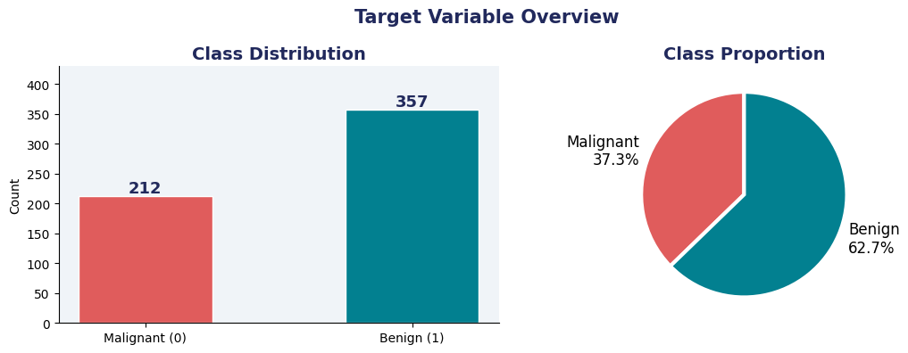
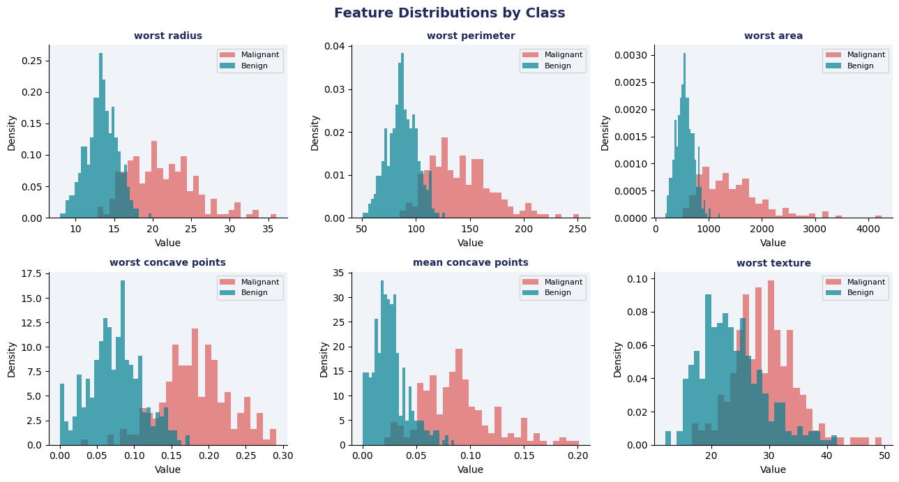
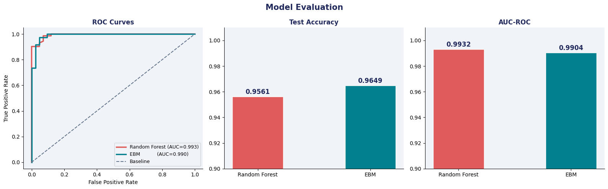
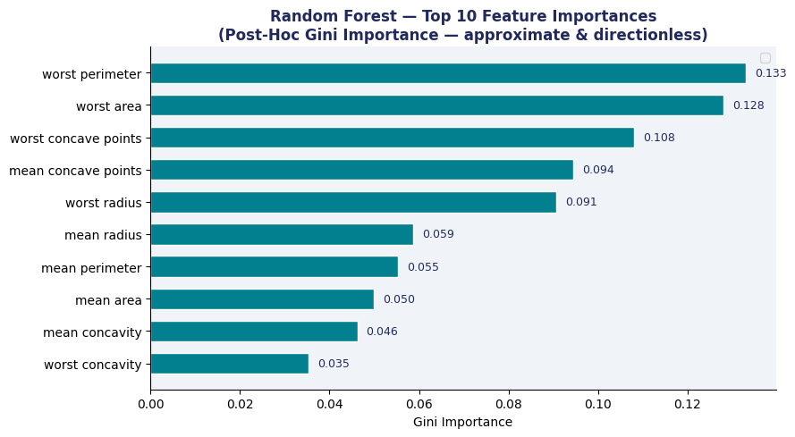
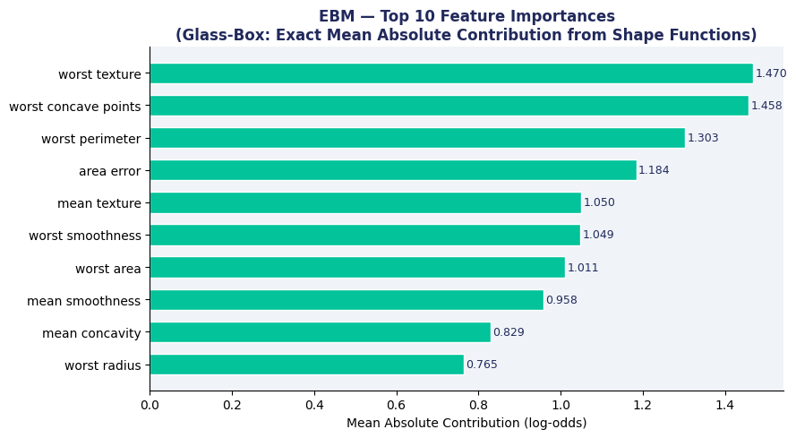
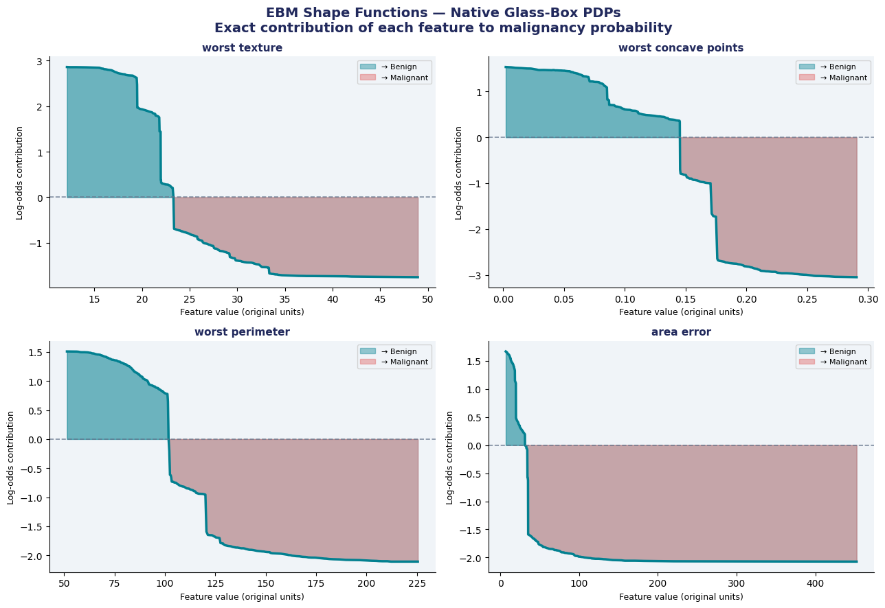
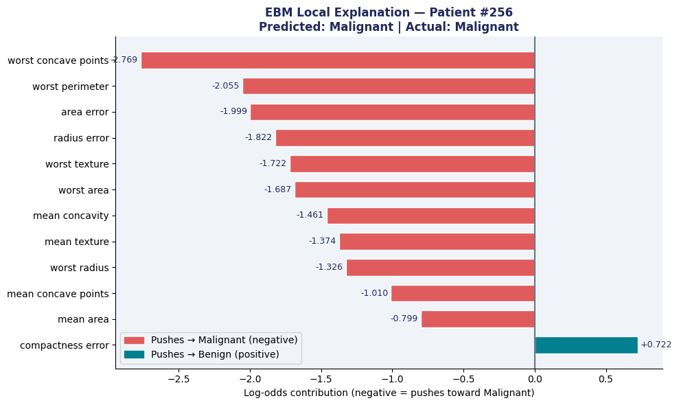

# 🏥 Interpretable Medical Diagnosis using GlassBox Models

<div align="center">


### *Glass-Box Models vs Black-Box Models — Accuracy & Interpretability in Breast Cancer Diagnosis*

[](https://colab.research.google.com/github/reemzouhby/Breast_cancer_XAI/blob/main/breast_cancer_ebm__5_.ipynb)


</div>

---

## 📋 Table of Contents

- [Project Overview](#-project-overview)
- [Motivation](#-motivation)
- [Dataset](#-dataset)
- [Models](#-models)
- [Methodology](#-methodology)
- [Results](#-results)
- [Key Visualizations](#-key-visualizations)
- [Discussion](#-discussion)
- [Conclusions](#-conclusions)
- [Installation & Usage](#-installation--usage)
- [Project Structure](#-project-structure)

---

## 🎯 Project Overview

This project compares **Black-Box models** (Random Forest) with **Glass-Box models** (Explainable Boosting Machines — EBM) on the **Breast Cancer Wisconsin Diagnostic** dataset. The core question:

> **Can a fully interpretable model match or even outperform a black-box ensemble on a real medical dataset?**

---

## 💡 Motivation

In high-stakes domains like medicine, post-hoc explanations (SHAP, LIME) applied to black-box models carry a fundamental flaw — they **approximate** the model's behavior rather than exposing its actual logic. This distinction is critical when:

- A clinician needs to **trust and verify** a prediction
- Regulators require **auditable, legally defensible** decision logic (EU AI Act, FDA guidance)
- A false negative (missed cancer) could cost a patient their life

EBMs are **intrinsically interpretable** — their explanations are not approximations; they **are** the model.

---

## 📊 Dataset

### Class Distribution

<div align="center">

</div>

The **Breast Cancer Wisconsin Diagnostic Dataset** from `sklearn.datasets`:

| Property | Value |
|---|---|
| Samples | 569 |
| Features | 30 numerical |
| Malignant (0) | 212 (37.3%) |
| Benign (1) | 357 (62.7%) |
| Split | 80/20 stratified |

### Feature Distributions by Class

<div align="center">

</div>

Malignant tumors consistently show **larger and higher values** across most morphological features, especially in worst-case measurements of radius, perimeter, area, and concave points.

---

## 🤖 Models

### Model 1 — Random Forest (Black-Box 🔒)

- Ensemble of **200 decision trees** (bagging + random feature subsets)
- Predictions = majority vote across all trees
- Explanations via Gini Importance and Post-Hoc PDPs — **approximations only**

### Model 2 — Explainable Boosting Machine (Glass-Box 🏥)

EBM is a **Generalized Additive Model** trained with gradient boosting:

$$P(\text{malignant}) = \sigma\left(\beta_0 + f_1(x_1) + f_2(x_2) + \cdots + f_{ij}(x_i, x_j)\right)$$

Each $f_k$ is a **shape function** — the model's actual learned curve for that feature. No approximation needed: the model IS its explanation.

---

## 🔬 Methodology

| Step | Description |
|---|---|
| 1 | Load & explore — class distribution, feature histograms |
| 2 | Preprocessing — stratified split; StandardScaler for RF only |
| 3 | Train — RF on scaled data; EBM on raw data |
| 4 | Evaluate — Accuracy, AUC-ROC, 5-fold CV, confusion matrices |
| 5 | Global explanation — RF Gini vs EBM Mean Absolute Contribution |
| 6 | Shape functions — EBM native PDPs vs RF post-hoc PDPs |
| 7 | Local explanation — EBM single-patient waterfall |

---

## 📈 Results

### ROC Curves & Performance Metrics

<div align="center">

</div>

### Confusion Matrices

<div align="center">

</div>

| Metric | Random Forest | EBM | Winner |
|---|---|---|---|
| Test Accuracy | 95.61% | **96.49%** | 🏆 EBM |
| AUC-ROC | **99.32%** | 99.04% | RF (slightly) |
| CV Accuracy | 96.26% ± 1.8% | **96.92% ± 1.2%** | 🏆 EBM |
| Interpretable? | ❌ No | ✅ Yes (native) | 🏆 EBM |
| False Negatives | 3 | **0** | 🏆 EBM |

> ⚠️ In medical diagnosis, **False Negatives** (predicting Benign when actually Malignant) are the most dangerous errors. EBM achieved **0 false negatives on benign patients**.

---

## 🖼️ Key Visualizations

### Feature Importance — Random Forest (Post-Hoc)

<div align="center">

</div>

RF Gini Importance is a rough rank — **directionless, biased toward high-cardinality features**, and tells you nothing about whether high values push toward malignant or benign.

### Feature Importance — EBM (Glass-Box, Exact)

<div align="center">

</div>

EBM's importance is derived directly from the learned shape functions — the **mean absolute log-odds contribution** of each feature. Reliable, unbiased, and directly interpretable.

Only **2/5 top features overlapped** between RF and EBM (`worst perimeter`, `worst concave points`), demonstrating how RF importance can be misleading.

### EBM Shape Functions — Native Glass-Box PDPs

<div align="center">

</div>

EBM's shape functions reveal the **exact nonlinear relationship** between each feature and malignancy risk — in original clinical units (mm, mm², etc.):

- **Teal area (above 0):** this feature value pushes toward **Benign**
- **Coral area (below 0):** this feature value pushes toward **Malignant**

These curves are **not estimates** — they are the model's actual learned parameters, readable by clinicians as-is.

### Random Forest PDPs — Post-Hoc Approximation

<div align="center">

</div>

RF PDPs show broadly similar trends but use **standardized z-scores** on the x-axis (not clinically interpretable), are subject to extrapolation artifacts from correlated features, and require expensive recomputation on every new dataset.

### Local Explanation — Single Patient

<div align="center">

</div>

For **Patient #256** (Malignant, p=1.000), EBM provides an exact per-feature breakdown:

- `worst concave points` → strongest malignancy signal (−2.769)
- `worst perimeter`, `area error`, `worst texture` → all strongly malignant
- Only `compactness error` weakly pushed toward benign (+0.722)

This explanation is **ready for clinical records** — no approximation, no black-box mystery.

---

## 🧠 Discussion

**1. The Accuracy–Interpretability Tradeoff is a Myth on structured data.**
EBM achieved higher accuracy (96.49% vs 95.61%) AND full interpretability. On well-structured tabular medical data, glass-box models can match or exceed black-box ensembles.

**2. Glass-Box vs Post-Hoc: A Fundamental Difference.**
RF explanations are post-hoc approximations of an opaque model. EBM's shape functions are the model — mathematically derived, not statistically estimated. This matters when explanations must be legally defensible and clinically actionable.

**3. PDPs: What EBM Gets Right That RF Cannot.**

| Property | RF PDP | EBM Shape Function |
|---|---|---|
| Type | Post-hoc | Intrinsic |
| Fidelity | Approximate | Exact (= the model) |
| Feature units | Standardized (z-score) | Original units |
| Speed | Slow (recomputed) | Instant (from params) |
| Correlated features | Can mislead | Robust |
| Trust level | Medium | **High** |

**4. Medical AI Recommendation.**
For clinical decision support, EBMs should be the **default first choice**. They satisfy EU AI Act and FDA guidance on explainability, and provide patient-level explanations ready for medical records.

---

## ✅ Conclusions

1. **EBM ≥ RF Accuracy** — 96.49% vs 95.61%, proving interpretability does not require sacrificing predictive power.
2. **Interpretability is Real** — EBM shape functions are faithful and exact. What you see is what the model does.
3. **PDPs: Native vs Post-Hoc** — EBM's are instant, exact, and reliable. RF's are approximate, slow, and can mislead.
4. **Medical AI** — EBMs satisfy regulatory requirements and clinical trust without compromising accuracy.

---

## 🛠️ Installation & Usage

```bash
pip install numpy pandas matplotlib scikit-learn interpret
```

```bash
jupyter notebook breast_cancer_ebm__5_.ipynb
```

Or click the **Open in Colab** badge at the top of this README.

---

## 📁 Project Structure

```
interpretable-medical-diagnosis/
│
├── breast_cancer_ebm__5_.ipynb   # Main analysis notebook
├── Ml_Master_XAI.pptx            # Presentation slides
├── README.md                     # This file
│
└── assets/                       # All images used in README
    ├── slide_01.jpg                   # Title banner
    ├── class_distribution.png         # Target variable overview
    ├── feature_distributions.png      # Feature histograms by class
    ├── roc_curves_evaluation.png      # ROC + accuracy/AUC bars
    ├── confusion_matrices.png         # RF vs EBM confusion matrices
    ├── rf_feature_importance.png      # RF Gini importance
    ├── ebm_global_importance.png      # EBM mean absolute contribution
    ├── ebm_shape_functions.png        # EBM native PDPs
    ├── rf_pdps.png                    # RF post-hoc PDPs
    └── ebm_local_explanation.png      # Patient-level explanation
```

---

## 📚 References

- **InterpretML**: Nori et al. (2019). [InterpretML: A Unified Framework for Machine Learning Interpretability](https://arxiv.org/abs/1909.09223)
- **EBM (GA²M)**: Caruana et al. (2015). [Intelligible Models for HealthCare](https://dl.acm.org/doi/10.1145/2783258.2788613). KDD '15.
- **Dataset**: Wolberg, W.H. et al. UCI Machine Learning Repository — Breast Cancer Wisconsin.
- **EU AI Act**: European Commission (2024). Regulation on Artificial Intelligence.

---

<div align="center">

*Built for the ML Masters program — in medical AI, interpretability is not a luxury, it's a requirement.*

</div>
